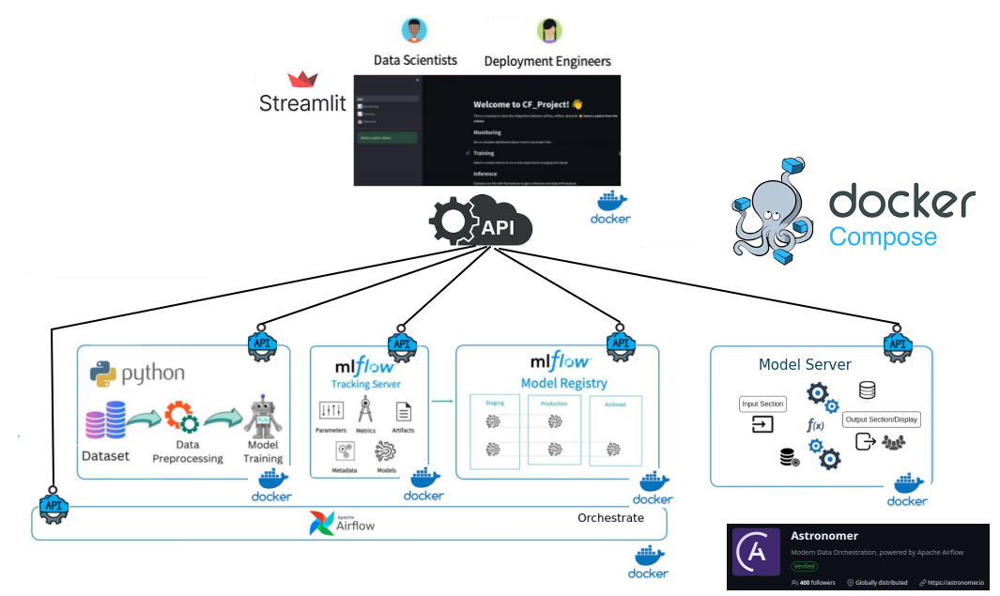
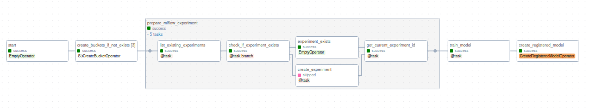
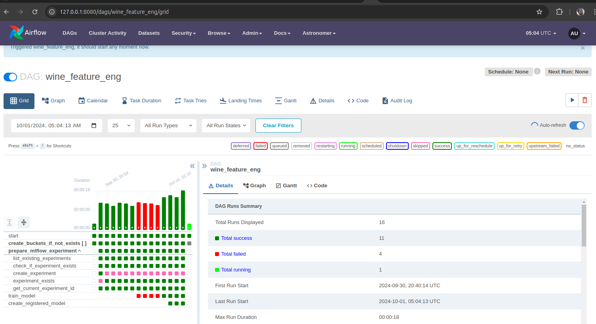
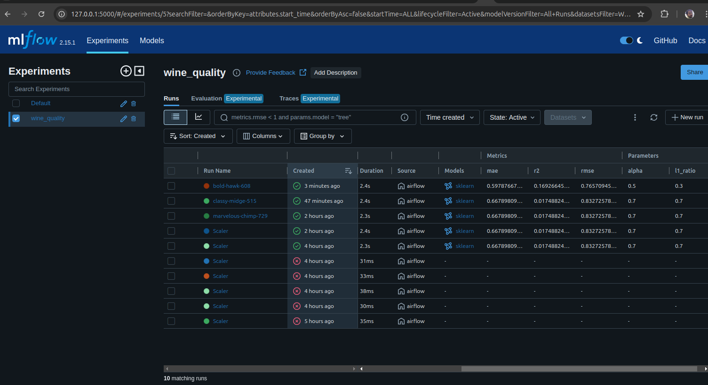
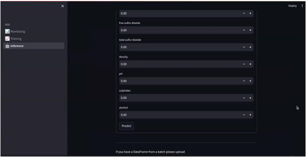
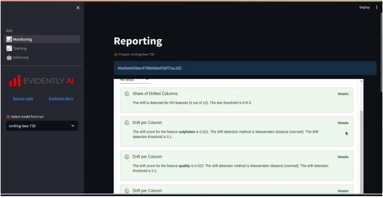

## Wine Quality tool with Airflow, MLflow, Evidently and Streamlit
## Problem description

Wine quality is an important metric because it could absolutely make or break the amount of money a restaurant, wine shop, or wine manufacturer makes during the year. e Moreover, wine quality will certainly harm the reputation of the restaurant, wine shop, or wine manufacturer as well.

If a restaurant, wine shop, or wine manufacturer is known to be making or selling wines that are of poor, subpar, or average quality, consumers will most likely not want to give their business to that particular restaurant, wine shop, or wine manufacturer and will instead want to take their business to a different shop, manufacturer, or restaurant which in turn will hurt the shop, manufacturer, or restaurant financially.

So from a financial and business standpoint, knowing the expected or predicted wine quality is definitely important to a wine shop, wine manufacturer, or restaurant both in the short term as well as in the long term


## Objective

The objective of this project is generate tools that helps with predictions about the wine quality for red wine. We would like centralize monitoring, testing and inference in a web app with a simple UI 

## Project content

### Data Source

[The dataset](https://archive.ics.uci.edu/dataset/186/wine+quality) used describes the amount of various chemicals present in wine and their effect on its quality.

Input variables in the data set consist of metrics from objective tests (e.g. acidity levels, PH values, ABV, etc.), while the target/output variable is a numerical score based on sensory data — median of at least 3 evaluations made by wine experts.

Each expert graded the wine quality between 0 (very bad) and 10 (very excellent). Due to privacy and logistic issues, there is no data about grape types, wine brand, and wine selling price.

Data was obtained from [https://archive.ics.uci.edu/dataset/186/wine+quality](https://archive.ics.uci.edu/dataset/186/wine+quality)


### Project Overview

This project  its divided in several parts parts:
	- [MLflow](https://mlflow.org/) was used for the experiment tracking and organization.
	- Combine Airflow and MLflow make a complete platform for ML orchestration (MLOx). Airflow orchestrate the different stages on MLflow
		- Show how you can use the Airflow API launch a orchestrated data pipeline
	- Use of [Evidently](https://www.evidentlyai.com/) to evaluate, test, and monitor AI-powered systems and data pipelines from experimentation to production.
	- Use  [fastapi](https://fastapi.tiangolo.com/) to get inference from the model within MLflow register
	- Demonstrate how you can use [streamlit](https://streamlit.io/) to  show Classification and Data Drift reports, generated with Evidently, access to MLflow experiment information and get inference from the model
	
	


	

#### Airflow DAG
We found inspiration in this [Astronomer.io tutorial](https://www.astronomer.io/docs/learn/airflow-mlflow)
The [`mlflow_integration`](https://github.com/ruralkan/fuzzy-train/blob/main/dags/mlflow_integration.py) DAG prepares the MLflow experiment and builds prediction features from the wine quality dataset.



The flow is integrated by 4 main tasks:
	-  create_buckets_if_not_exists
	-  prepare_mlflow_experiment
	-  train_model
	-  create_registered_model

We are generated the module named include/model.py that contains the Model Class. This class contains information like:

```python 
class Model:
	def __init__(self):
		self.ml_flow_artifact_bucket = "mlflowdataredwine"
		self.experiment_name = "wine_quality"
		self.file_path = "include/winequalityred.csv"
		self.alpha = 0.7
		self.l1_ratio =0.7
```
With this attributes we can specify the name of experiment, the bucket the artifacts of experiment, the data path and the hyper parameters for the model.

Additionally we can set the experiment and instrumented with MLflow and/ or evidently.ai

```python
def run_model(self):

	warnings.filterwarnings("ignore")
	np.random.seed(40)
	# Read the wine-quality csv file from local
	data = pd.read_csv(self.file_path)
	data.to_csv(self.file_path, index=False)
	# Split the data into training and test sets. (0.75, 0.25) split.
	train, test = train_test_split(data)
	# The predicted column is "quality" which is a scalar from [3, 9]
	train_x = train.drop(["quality"], axis=1)
	test_x = test.drop(["quality"], axis=1)
	train_y = train[["quality"]]
	test_y = test[["quality"]]
	alpha = self.alpha
	l1_ratio = self.l1_ratio
	lr = ElasticNet(alpha=alpha, l1_ratio=l1_ratio, random_state=42)
	lr.fit(train_x, train_y)
	predicted_qualities = lr.predict(test_x)
	(rmse, mae, r2) = self.eval_metrics(test_y, predicted_qualities)
	mlflow.log_param("alpha", alpha)
	mlflow.log_param("l1_ratio", l1_ratio)
	mlflow.log_metric("rmse", rmse)
	mlflow.log_metric("r2", r2)
	mlflow.log_metric("mae", mae)
	mlflow.log_artifact(self.file_path)
	mlflow.sklearn.log_model(lr, "wine_regression")
```



When mlflow_integration DAG finish, we could have a new experiment and/or run on mlflow UI



**Model Prediction and Scoring Pipeline**
After we have registered an MLflow model, we can fetch that model using `mlflow.<model_flavor>.load_model()`, or more generally, `load_model()`.

``` python
"""Loading specific version of model"""  
import mlflow.pyfunc

model_name = "<model-of-choice>"  
stage = 'Staging'  
model_uri = f"models:/{model_name}/{stage}"model = mlflow.pyfunc.load_model(model_uri=model_uri)  
model.predict(data)"""Loading specific type of models like sklearn"""  
mlflow.sklearn.load_model("models:/<model>/<version>")"""Loading Latest Production Version of model"""  
import mlflow.pyfunc  
model_name = "<model-of-choice>"  
stage = 'Production'model_uri = f"models:/{model_name}/{stage}"  
model = mlflow.pyfunc.load_model(model_uri=model_uri)  
model.predict(data)
```

#### Serving an MLflow Model from Model Registry

After we have registered an MLflow model, we can serve the model as a service through fast API or streamlit.
```python
model_name = "wine_quality"

model_version = 1

model = mlflow.sklearn.load_model(

model_uri=f"models:/{model_name}/{model_version}"

)

y_pred_new = model.predict(X_new)
```
Once we have deployed the server, we can pass it some sample data and see the predictions. The following example uses the web interface to inference



#### Monitoring Datadrift
We have implement ['evidently.ai'](https://www.evidentlyai.com/) to generate a monitoring data drift during the training and generate the reports. The reports has saved in MLflow registery as artifact and display with streamlit




## Run the project

To run the example project, first make sure Docker Desktop is running. Then, open your project directory and run:

``` bash
astro dev start
```

or

``` bash
docker compose -f docker-compose.override.yml -d up
```

This commands builds your project and spins up 7 Docker containers on your machine to run it:

- The Airflow webserver, which runs the Airflow UI and can be accessed at `https://localhost:8080/`.
- The Airflow scheduler, which is responsible for monitoring and triggering tasks.
- The Airflow triggerer, which is an Airflow component used to run deferrable operators.
- The Airflow metadata database, which is a Postgres database that runs on port `5432`.
- A local [MinIO](https://min.io/) instance, which can be accessed at `https://localhost:9000/`.
- A local [MLflow](https://mlflow.org/) instance, which can be accessed at `https://localhost:5000/`.
- A local Streamlit app which can be accessed at `https://localhost:8000/`.

